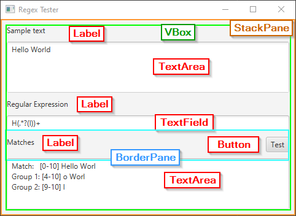

# if.05.11-09_FX_RegexTester

__Goal__:   
Implement an JavaFX application for testing regular expressions

__Assignment:__   
Implement a an JavaFX application for testing regular expressions.   
The application UI shall be coded.   
The application shall feature entering a sample text as well as a regular expression. 
The regular expression shall be matched against the sample text and the matches, 
including groups and indexes of start and end characters within the sample text,
shall be presented.

*Note:*   
This assignment is based on assignment "CLI RegexTester". The logic for
matching text against regular expressions may be reused from that assignment.

__Sample UI:__   
The application may look like shown below

The shown sample UI shall give you an idea how to structure the HMI of 
the application using JavaFX Controls.   
You may design and style your application as you wish as long the required
features are supported. E.g. the 'Matches' text area could be replaced by
something more advanced, such as a list (ListView) or table (TableView).
